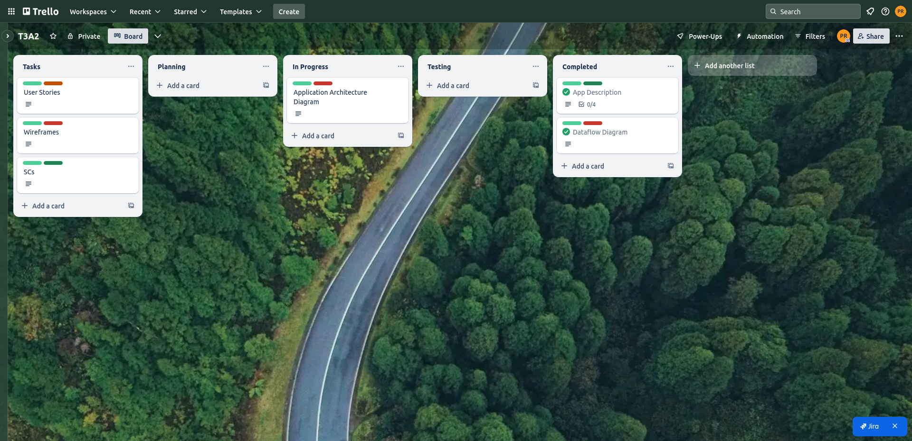

# PaperTrade

### Purpose

This MERN stack micro-investing app is designed for training and demonstration purposes. It simulates the core functions of a trading platform, allowing users to practice buying and selling shares with a fictitious balance, while drawing on real market data for enhanced realism. The goal is to provide an accessible, low-risk environment for learning how trading works without the complexity or compliance overhead of handling actual funds.

### Functionality / Features

**User Onboarding**: Simple registration with a preset demo balance.

**Simulated Trades**: Users place orders at the current market price retrieved from a free-tier stock data API (Tiingo).

**Portfolio Tracking**: Real-time updates to holdings, profit/loss, and account balance.

**Popular Stocks List**: A top-10 list that offers insight into trending shares for an added social element.

**Admin Panel**: Provides role-based access for oversight of user accounts and order histories.

### Target Audience

**Aspiring Traders and Students**: Individuals or groups wanting to explore trading concepts in a safe, zero-risk setting.

**Educators and Training Programs**: Institutions or course providers needing an interactive tool to teach investment fundamentals.

### Tech Stack

**Frontend**: React for building the user interface and handling navigation.

**Backend**: Node.js with Express for managing API routes and core business logic.

**Database**: MongoDB for storing user profiles, simulated trades, and portfolio data.

**Authentication**: JSON Web Tokens (JWT) for secure user sessions and access control.

**Market Data**: A free-tier API (Tiingo) for real-time or near real-time US stock quotes.

## Data Flow Diagram

## Application Architecture Diagram

## User Stories

### Lucy

Lucy is a 23 year old novice investor. She wants the app to have a sign up process that is fast and has minimal steps,
and would like to receive a preloaded demo balance on account creation. She is eager to start learning trading and doesn't want to be
bogged down by lengthy forms.

A revised registration process that does not require lots of information will be replacing the existing one, in accordance with the feedback.
Registration is streamlined to just username and password. Additional information is optional.

### Lana

Lana is a 24 year old beginner investor, she has had some prior experience on similar software. The most important thing for Lana is having the ability
to easily assess her open positions and trade performance without having to dig around through the app. She wants a clean dashboard that can display
her current holdings, total balance and profit/loss simply and directly.

Initially the project was going to have a simple 'view holdings' functionality. However, this has been revised to include real-time (or near real-time) profit/loss
and a visual summary of the position.

### Marco

Marco is a 33 year old learner and casual investor. He would like a simple and quick display of the most popular trades at the time so that he can keep up with market trends.
He desires to use the crowd interest as a factor in his own trading choices.

Inital designs included a fully functional social media platform, however this was determined to be not feasible within the time frame. As a result,
the revised 'popular trades list' will be added to help users understand market trends and have a small social element to the application.

### John

John is a 40 year old who is new to investing and is looking to use our software to understand how to navigate trading and trade software in the future.
John would like to place orders at market price to mimic actually opening positions without having to risk his finances. He is not very well versed in
trades and would like a simple process.

The initial plan for the trade functionality was to include multiple order types (such as limit and stop). Feedback indicated that this was overwhelming to
new users, as such revisions were made to only include market orders for now.

### Julia

Julia is a 27 year old who works with a fintech start up that plans on using the software to train new investors. She wants to be able to view a list of users,
help with resetting passwords and deactivate unused accounts as needed. This will allow here to quickly address and issues that her trainee investors have
while also keeping the system clear of dead accounts and accounts that are not following terms of service and use.

The initial design only included a 'view users' functionality. After some discussion and feedback, the need for password resets and account deactivation
was discovered and the design was revised accordingly.

## Wireframes

### Phone View

#### Home Page

.png)

#### Portfolio Page

.png)

#### Order Page

.png)

### Tablet View

#### Home Page

.png)

#### Portfolio Page

.png)

#### Order Page

.png)

### Desktop View

#### Home Page

.png)

#### Portfolio Page

.png)

#### Order Page

.png)

## Trello Logs

### Log 1

### Log 2

### Log 3

### Log 4

### Log 5

